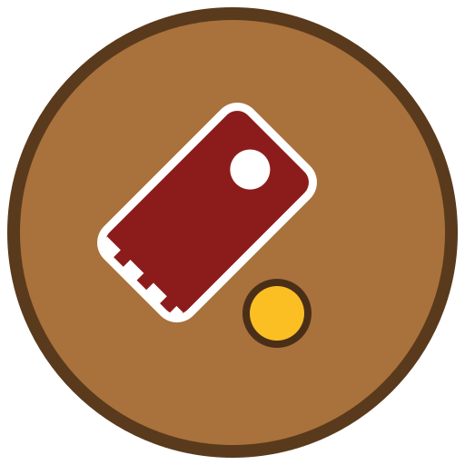

<p align="center">
  
</p>

<h1 align="center">SPIN</h1>

<p align="center">
  <strong>A training tool for powerchair football</strong> — tactics board, drill editor, sessions, rules<br>
  Use it in the browser at <a href="https://spin.atit.app"><strong>spin.atit.app</strong></a>. Nothing to install.
</p>

<p align="center">
  <a href="LICENSE"></a>
  
  
  <a href="CONTRIBUTING.md"></a>
</p>

<p align="center"><a href="README.md">한국어</a></p>

---

## What is powerchair football?

Four players per side, each in a powered wheelchair, play football on an indoor court the
size of a basketball court. A **foot guard** bolted to the front of the chair pushes and
strikes a 33 cm ball. The international rules are the *Laws of the Game* published by
**FIPFA** (Fédération Internationale de Powerchair Football Association); this app follows
the 2025 edition.

Tactics in this sport rest on one rule above all: **two players from the same team inside a
3 m radius of the ball is a foul** (2-on-1). "A good position" therefore means something
different from football, and a whiteboard cannot show you that distance. **SPIN draws it on
the board.**

## What it does

- **Tactics board** — put chairs and a ball on the court and push them around. The 2-on-1
  ring, goal-area occupancy, and the 5 m set-piece restriction are judged live and shown in
  colour.
- **Drill editor** — build motion step by step, with arrows, freehand strokes, notes, and
  explicit draw order.
- **Training sessions** — chain drills into a session with time allocation and notes.
- **Teams and rosters** — manage players and shirt numbers, assign them to slots in a drill.
- **Presentation mode** — play a drill full screen, for showing players at the court.
- **Rules** — learn the FIPFA Laws through **nine topic cards** rather than article order.
  Each card mixes prose, diagrams, an animated board scene, and comparison tables.
- **Export** — PNG, printable PDF session plans, MP4 video, and backup files.
- **Google Drive sync** — through the user's own account, in an app-private folder.
- **Share links** — hand a drill or session to someone as a link. **End-to-end encrypted**:
  the key lives only in the URL fragment (`#`) and never reaches the server, which stores
  ciphertext it cannot open.
- **In development** — desktop apps (Windows, Linux, macOS via Tauri) and mobile apps (iOS,
  Android, Chrome web app) are still being built. Today the finished product is the web app.
- **Korean, English, Japanese**, and **fully operable by keyboard alone**.

### About hosting

[spin.atit.app](https://spin.atit.app) is run by one person, at their own expense, as a
contribution. **It may go offline at any time without notice.** That is why the code is
public — if your team or federation depends on it, **host it yourself.** The app builds to
static files that any web server can serve; see the deployment section of
[docs/DEVELOPMENT.md](docs/DEVELOPMENT.md). Your data lives only on your device and in your
own Google Drive, so a change of address is a backup file away.

### Who it is for

**Coaches and managers** of powerchair football teams come first: planning a session,
showing it to players, and printing it to hand out all live in one place. **Players and
referees** get their own use out of the rules screen, where 2-on-1 and goal-area fouls are
animated scenes rather than article text. No account is required and nothing is installed.

## Getting started

Requires **Node 22.18 or newer** (see `engines` in `package.json`; CI runs on 22). The share-link server runs `.ts` directly, with no build step.

```bash
git clone https://github.com/from104/spin.git
cd spin
npm ci
npm run dev          # dev server at http://localhost:5173
```

| Command | What it does |
|---|---|
| `npm run dev` | Dev server |
| `npm run build` | Typecheck + production build + static prerender of the rules pages |
| `npm run typecheck` | Type errors only |
| `npm run lint` | oxlint |
| `npx vitest run` | Full test suite |
| `npm run test:rel <file>` | Only the tests that touch that file |
| `npm run tauri:dev` | Desktop shell against the dev server |
| `npm run tauri:build` | Desktop installers |

### Environment variables

**The app runs with none of them set.** Without values, only Google Drive sync is disabled.

The key names live in [`.env.example`](.env.example); copy it to `.env.local` and fill it in.
**You must issue your own Google OAuth client** at the
[Google Cloud Console](https://console.cloud.google.com/) — this repository does not ship
one. Web and desktop need separate clients of different types (Web application / Desktop
app); the reasoning is in [docs/DEVELOPMENT.md](docs/DEVELOPMENT.md) (Korean).

Deployment targets (host, account, SSH key) are likewise absent from the repository — see
[`.env.deploy.example`](.env.deploy.example).

## Project layout

```
src/
├─ model/      Data model, validation, rule judgement (court.ts is the single source of coordinates)
├─ physics/    matter.js wrapper, four-zone chair kinematics, hit testing
├─ render/     SVG rendering (CourtStage.tsx is the stage, objects/ draws each entity)
├─ store/      Editor state (reducer)
├─ storage/    IndexedDB and file I/O
├─ features/   Screens (board · editor · library · sessions · present · rules · print · export · settings)
├─ ui/         Shared UI parts
├─ core/       Constants, keymap, ids
├─ app/        Shell and routing
└─ test/       Cross-checking tests (including doc-to-code comparisons)

server/share/  Share-link backend (stores only end-to-end encrypted blobs)
src-tauri/     Desktop shell (Rust)
```

If you read only three files, read **`src/core/constants.ts` → `src/model/court.ts` →
`src/render/CourtStage.tsx`**: where the numbers come from, how coordinates are defined, and
where the two meet on screen.

## Documentation

Most documents are in Korean; the rules summary and the changelog also have English editions.

| Document | Contents |
|---|---|
| [docs/OVERVIEW.md](docs/OVERVIEW.md) | **Why it looks like this** — the sport, the screens, the design spine (coordinates, chair kinematics, accessibility), the code map |
| [docs/DEVELOPMENT.md](docs/DEVELOPMENT.md) | **How to run and ship it** — commands, verification discipline, deployment, Tauri details |
| [AGENTS.md](AGENTS.md) | **The canonical working conventions** — code, commits, docs, tests, i18n |
| [CONTRIBUTING.md](CONTRIBUTING.md) | How to contribute (Korean, with an English section) |
| [docs/DESIGN.md](docs/DESIGN.md) | Implementation contract for coordinates, judgement, rendering |
| [docs/REQUIREMENTS.md](docs/REQUIREMENTS.md) | Requirements of record |
| [ROADMAP.md](ROADMAP.md) · [CHANGELOG.en.md](CHANGELOG.en.md) | Plans and change history |
| [docs/RULES-FIPFA-2025.en.md](docs/RULES-FIPFA-2025.en.md) | The **rule facts of record** the app judges against — a summary of the FIPFA *Laws of the Game* 2025 edition, published by [FIPFA](https://www.fipfa.org/) |

## Contributing

**Contributors are always welcome** — code, translations, rule corrections, bug reports,
accessibility findings. Issues and pull requests in **Korean, English, or Japanese** are all
fine.

Read [CONTRIBUTING.md](CONTRIBUTING.md) first. It covers the base branch (`devel`), commit
conventions, and the gates a PR must pass: `npm run typecheck`, `npm run lint`, and
`npx vitest run`. **Open an issue before a PR** unless it is a trivial typo.

This project follows the [Contributor Covenant](CODE_OF_CONDUCT.md). Report vulnerabilities
through [SECURITY.md](SECURITY.md), not through public issues.

## License

[MIT](LICENSE) — Copyright (c) 2026 Seo Kihyun (from104).

The `"private": true` field in `package.json` only means this is never published to npm. It
is a web app rather than a library, and the code is yours to use under the MIT terms above.

The rules documents ([docs/RULES-FIPFA-2025.en.md](docs/RULES-FIPFA-2025.en.md) and the
in-app rules screen) are a **summary of the FIPFA *Laws of the Game*, which FIPFA owns.**
That is separate from the code licence, so check the original work's terms before reusing
that material.
